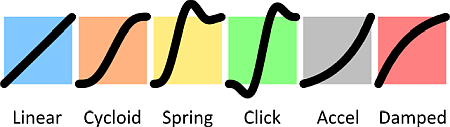
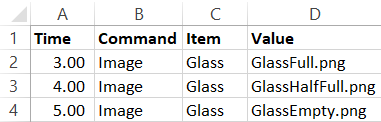
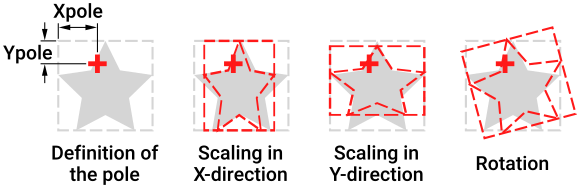

# ANIMATE
Animate is an interpreter written in Python which reads a timed sequence of commands from an Excel file and a number of bitmap images, and then composes movie frames with these commands. It can make simple animations, but also much more complex ones. No Python knowledge is needed to use this library.


Features:
* it can handle location, rotation, scale and opacity of many images in parallel
* the transitions can be asynchronous
* the stacking of images can be modified on the fly
* it can use nested scripts to generate a composed image that can be used in a script on a higher level
* since Animate uses a spreadsheet to define the animation, all parameters can be driven by relations in the spreadsheet
* to speed up debugging
    * Animate can create frames at a very low frame rate or it can only process frames between a certain interval
    * only a subset of the frames can be recomputed
    * the time can be plotted in the lower left corner of every frame    
* frames can be combined to produce an animated GIF or a movie

Animate heavily relies on open source software such as Python, the Python Imaging Library (PIL) and XLRD. Many thanks to the creators of this great software. Please don't forget to donate to all these great projects.

# Table of Contents

* [Typical workflow](#typical-workflow)
* [Dependencies](#dependencies)
* [List of examples](#list-of-examples)
* [The `SCRIPT` command](#the-script-command)
* [The `TABLE` command](#the-table-command)
* [Time in Animate](#time-in-animate)
* [Coordinate system](#coordinate-system)
* [Types of items](#types-of-items)
* [`BRINGTOFRONT` and `SENDTOBACK`](#bringtofront-and-sendtoback)
* [The `IMAGE` item](#the-image-item)
* [The `TEXT` item](#the-text-item)
* [Scaling, rotating and the pole](#scaling-rotating-and-the-pole)
* [The `ASSEMBLY` item](#the-assembly-item)
* [Working with `TIMEOFFSET`](#time-offset)
* [The `MASK` item](#the-mask-item)
* [The `CANVAS` item](#the-canvas-item)
* [Using a `TABLE` more than once](#using-a-table-more-than-once)
* [Using the main script at a lower `ASSEMBLY`](#using-the-main-script-at-a-lower-assembly)
* [Known issues](#known-issues)
* [To do for future versions](#to-do-for-future-versions)

# Typical workflow

The animation can be controlled by one or more sheets in a single Excel file:
* In a `SCRIPT`, items can be declared and manipulated
* A `TABLE` is similar to a script but the data is stored in tabular format and some commands cannot be used

An Animate project directory looks like this:
* An Excel file which holds all `SCRIPT`s and `TABLE`s (currently, .xls files are supported but .xlsx files not)
* A Python file which imports and calls Animate and refers to the Excel file and the main script
* A `../Pictures` subdirectory which holds all images used in the animation. The bitmaps are typically .png files with transparent background. They can for instance be created using [Inkscape](https://inkscape.org/).
* A `../Frames` subdirectory which holds all frames generated by Animate. Does not have to be created by the user, Animate will create this directory if it does not yet exist. Can also be removed to save disk space after the project is completed.

The Excel file typically contains various sheets, each containing a `SCRIPT`, `TABLE`, `ASSEMBLY` or `CANVAS`. One `SCRIPT` is the main script that is reffered to in the Python file. 

The Python file typically contains just two lines of code:

```python
from Animate import Animate
Animate.Model('Simulation.xls', 'Main')
```
The two parameters refer to the Excel file and the name of the sheet that contains the main script.

# Dependencies

The following libraries must be installed:

| <!-- --> | <!-- --> | <!-- --> |
|----------|----------|----------|
| `python`        | >v3.0                     | python.org                                 |
| `animate`       | pip install py-animate    | https://github.com/henkjannl/py-animate    |
| `xlrd`          | pip install xlrd          | http://www.python-excel.org/               |
| `pillow`        | pip install Pillow        | https://python-pillow.org/                 |
| `ffmpeg`        |                           | https://ffmpeg.org/                        |
| `ffmpeg-python` | pip install ffmpeg-python | https://github.com/kkroening/ffmpeg-python |

Remarks:
* ffmpeg is only needed if video files need to be created
* in order to use ffmpeg, the ffmpeg library itself first needs to be installed on the system
* ffmpeg-python is a python binder to ffmpeg. Please make sure ffmpeg-python is spelled correctly, there are various similar libraries with different spelling

# List of examples

The examples are provided for inspiration:

| <!-- --> | <!-- --> |
|----------|----------|
| [01-bulldozer](examples/01-bulldozer/Readme.md)                         | `SCRIPT`, `IMAGE` and `XPOS`       |
| [02-bulldozer-with-table](examples/02-bulldozer-with-table/Readme.md)   | `TABLE`                            |
| [03-solar-system](examples/03-solar-system/Readme.md)                   | `BRINGTOFRONT` and `SENDTOBACK`    |
| [04-rotating-text](examples/04-rotating-text/Readme.md)                 | `TEXT`, `XPOLE` and `YPOLE`        |
| [05-rotating-cloud](examples/05-rotating-cloud/Readme.md)               | `XPOLE`, `YPOLE` and `ROTATION`    |
| [06-bulldozer-with-bucket](examples/06-bulldozer-with-bucket/Readme.md) | `ASSEMBLY`                         |
| [07-bouncing-balls](examples/07-bouncing-balls/Readme.md)               | `TIMEOFFSET`                       |
| [08-two-cylinders](examples/08-two-cylinders/Readme.md)                 | `MASK`                             |
| [09-canvas](examples/09-canvas/Readme.md)                               | `CANVAS`                           |
| [10-car](examples/10-car/Readme.md)                                     | `TABLE` driving multiple `SCRIPT`s |
| [11-camera](examples/11-camera/Readme.md)                               | Same `ASSEMBLY` on multiple levels |

# The `SCRIPT` command
A `SCRIPT` is a timed sequence of commands that influence properties

The columns have a predefined meaning:

| <!-- --> | <!-- --> |
|----------|----------|
| Column A | Contains the time at which an event takes place     |
| Column B | Contains a property or a command                    |
| Column C | Contains an item name or a value                    |
| Column D | Contains a value, if column C contains an item name |

Remarks:
* The other columns can be used for comments or for calculations
* If the cell in column A does not contain a number, the complete row is ignored by the script and can be considered to be a comment
* The time does not have to be ordered
* By definition, Frame0000 corresponds to time 0.00 seconds in the main `SCRIPT`
* Items do not need to be explicitly created. If the item occurs for the first time in the script, Animate automatically creates a new item. Therefore, pay attention to spell the names of the items correctly; if an item name is spelled incorrectly, a second item will be created
* Animate checks if every `Image` item has at least one image designated. If not, an error is raised.
* Commands, properties and item names are not case sensitive
* All items have most properties in common

<br>

In [Example 1](examples/01-Bulldozer/Readme.md), the `SCRIPT` command is demonstrated. 

<br>

# The `TABLE` command
When the `TABLE` command is used in a script, the name after the `TABLE` refers to the sheet name in which the `TABLE` is defined. A `TABLE` sheet must be formatted as follows:

| <!-- --> | <!-- --> | <!-- --> |
|----------|----------|----------|
| **Column A** | Specifies the time at which the event takes place                 | The time does not have to be ordered. Animate orders the time and interpolates between the given values.<br>If column A does not contain a number, the row is ignored, cells can be used as comment or for internal calculations |
| **Row 1**    | Specifies the name of the item that needs to be modified          | Items cannot be created in a `TABLE`. Items declared in the calling `SCRIPT` can be modified by a `TABLE` <br> If an item name is not declared in the `SCRIPT` that calls the table, it will be ignored by that script.<br>Note that the same table can also be called by another script, in which the item can be declared |
| **Row 2**    | Specifies the property of the item that needs to be modified      | |
| **Cells**    | Specifies the value for the property of the item at the given time | Not every cell in a time/item combination has to have a value.<br>If a cell has no value, the transition happens smoothly between the time/value pairs that are defined |

Remarks:
* The `TABLE` allows a more compact way to describe transitions
* A number is required in column A to distiguish the row from a comment row. However, the value of the time before the TABLE command is ignored. 
* The times in column A do not have to be ordered
* If values for a property are missing for certain points in time, Animate will interpolate between the values that are present
* If `FIRSTFRAME` and `LASTFRAME` are not specified, the animation will run from t=0 until the last point in time specified
* Between time 0 and the first specified value, the property will be constant until the first specified value
* Same for the last specified value until the end of the animation
* A script can call more than one table.
* More than one script can call the same table. If the table controls an item that is not in the calling script, the item is ignored


In [Example 2](examples/02-bulldozer-with-table/Readme.md), the `TABLE` command is demonstrated. 

# Time in Animate

* In Animate, time is specified in seconds
* By definition, the animation starts at 0 seconds and frame 0 corresponds to t=0 s
* The `FRAMERATE` command defines the ratio between frames and seconds
* Rendered frames are stored in the `../Frames` subdirectory. If this directory does not exist, it will be created by Animate
* By default, the last event in all script is used to determine how long the animation takes
* If a shorter animation is desired, the `LASTFRAME` command can be used to define the duration. Note that this is a frame number and not a time in seconds

## Debugging
* For debugging purposes, the `FIRSTFRAME` and `LASTFRAME` commands can be used to render a subset of the frames
* Also for debugging purposes, it can be helpful to temporatily use a lower `FRAMERATE` to test if the animation works well
* With a bitmap viewer such as IrfanView, it is easy to browse though the `../Frames` directory, to check which frames need to be re-rendered
* It is also possible to use `SHOWTIME` to display the time in each frame 

# Coordinate system
Animate uses the same coordinate system conventions as bitmaps:
* the origin is in the upper left corner
* positive X-axis is to the right
* positive Y-axis is down

# Types of items
The following types of items are defined:
| <!-- --> | <!-- --> |
|----------|----------|
| `IMAGE`    | retrieves an bitmap from disk and makes it part of the animation   |
| `TEXT`     | displays text                                                      |
| `ASSEMBLY` | an item that is dynamically made up of other items                 |
| `CANVAS`   | similar to an `ASSEMBLY`, but not erased between subsequent frames |
| `MASK`     | used to mask certain parts of the items below the mask             |

## Global commands
The following commands are only relevant for the main script. These commands are ignored for other scripts:

| <!-- --> | <!-- --> |
|----------|----------|
| `FRAMESPERSECOND` | Sets  the number of frames per second of the animation. This is how the floating point number of the time column translates to discrete frames. |
| `FIRSTFRAME`      | This is property for debug purposes. If the total script takes very long to process, only a subset of the frames can be processed. The value following the `FIRSTFRAME` command references the actual frame number, not the time to which the frame corresponds. |
| `LASTFRAME`       | Similar to `FIRSTFRAME` to determine the last frame in the scene that is processed. |
| `SHOWTIME`        | This property is also for debug purposes. Displays the time in the lower left corner of the frames |
| `HIDETIME`        | Hides the time in the lower left corner of the frames |
| `ANIMATEDGIF`     | Creates an animated GIF of the frames that were created, with a filename followed by the `ANIMATEDGIF` command |
| `MOVIE`           | Creates an mpeg movie of the frames that were created, with a filename followed by the `MOVIE` command |

Remarks:
* For these global commands, a number must be present in column A to prevent the row is ignored, but the value of this number is ignored
* For short animations, AnimatedGIF is conventient.
* If the animation is larger, the GIF file will become very large, and Movie is more suitable
* The AnimatedGIF command stores the rendered images in memory and then creates the GIF at the end. This can require much memory. Only the frames between `FIRSTFRAME` and `LASTFRAME` end up in the animated GIF
* The Movie command uses the frames in the `../Frames` directory. Therefore, all rendered frames are used. If going from a high to a low `FRAMERATE`, ensure to remove the frames that are no longer needed from the `../Frames` directory before creating the movie
* If you plan to create a movie, please choose a standard movie format, such as 720x576 (PAL) 1280×720 (HD720p) or 1920×1080 (HD1080p), to ensure the output is compatible with standard movie players.
* After the Movie or AnimatedGIF has been created, the `../Frames` directory can be removed to save disk space

## Properties common to all items
All items have the following properties in common:

Position, scaling and orientation:
| <!-- --> | <!-- --> |
|----------|----------|
| `XPOS`     | The horizontal position on which the item is positioned.<br>The position corresponds to the position of the image as if the rotation of the image is zero and the scale is 100% in horizontal and vertical direction.<br>Note that the origin of the coordinate system is the top left corner of the image, if `XPOS`=0, the left side of the item will be aligned to the left side of the output stream. |
| `YPOS`     | The vertical position on which the item is positioned.<br>Note that the origin of the coordinate system is the top left corner of the image, if `YPOS`=0, the top of the item will be aligned to the top of the output stream. |
| `ROTATION` | The rotation of the item in degrees.<br>Positive angles are counterclockwise.<br>Angles can be less than 0° or more than 360° to support multiple revolutions.<br>Rotation and scaling is explained in more detail [in this paragraph](#scaling-rotating-and-the-pole) |
| `XSCALE`   | The scale of the item in horizontal direction. A value of 1 means that the scale is not changed.<br>See also the paragraph on [the pole](#scaling-rotating-and-the-pole) |
| `YSCALE`   | The scale of the item in vertical direction.<br>See also the paragraph on [the pole](#scaling-rotating-and-the-pole)         |

Position, scaling and orientation modifiers:

| <!-- --> | <!-- --> |
|----------|----------|
| `XMOVE`    | The velocity profile of the movements in horizontal direction. Possible values are explained below |
| `YMOVE`    | The velocity profile of the movements in vertical direction |
| `RMOVE`    | The velocity profile of rotation |
| `SXMOVE`   | The velocity profile of scaling in horizontal direction |
| `SYMOVE`   | The velocity profile of scaling in vertical direction |

The position, scaling and orientation modifiers can have the following values:

| <!-- --> | <!-- --> |
|----------|----------|
| `LINEAR`   | the property changes proportional to time                         |
| `CYCLOID`  | the property changes with a smooth start and finish               |
| `SPRING`   | the property moves to the other value with some dynamic overshoot |
| `ACCEL`    | the property accelerates from low speed to high speed             |
| `DAMPED`   | the property starts fast and then decelerates                     |

The different values can be depicted as follows:



Other properties that are common to all items:

| <!-- --> | <!-- --> |
|----------|----------|
| `XPOLE`        | The pole around which the item is rotated and scaled |
| `YPOLE`        | The pole around which the item is rotated and scaled |
| `OPACITY`      | Determines the transparency of the item. A value of 0 means the item is invisible, a value of 1 means the item is opaque | 
| `BRINGTOFRONT` | Changes the Z-order of the item list, bringing this item on top of the others. This property does not need a value |
| `SENDTOBACK`   | Changes the Z-order of the item list, sending this item to the bottom of the list |
| `TEXTCOLOR`    | Specific for text items: the color for the font of the text |
| `FONT`         | Specific for text items: the font for the text              |

## Properties specific to `SCRIPT`, `ASSEMBLY` and `CANVAS`

| <!--     --> | <!-- --> |
|--------------|----------|
| `WIDTH`      | Sets the width of the output frames, measured in pixels                |
| `HEIGHT`     | Sets the height of the output frames                                   |
| `SCRIPT`     | Calls a `SCRIPT` in another worksheet                                  |
| `TABLE`      | Calls a `TABLE` in another worksheet                                   |
| `ASSEMBLY`   | Creates an `ASSEMBLY` item and calls the worksheet where it is defined. The worksheet that is referred to must be formatted as a `SCRIPT` |
| `CANVAS`     | Creates a `CANVAS` item and calls the worksheet where it is defined. The worksheet that is referred to must be formatted as a `SCRIPT` |
| `IMAGE`      | Loads a different image for an `IMAGE` item                            |
| `TEXT`       | Overwrites the text for a `TEXT` item                                  |
| `TIMEOFFSET` | Applies only to `ASSEMBLY` and `CANVAS`. Determines the time difference between the time base of the calling script and the called script. This is useful if the `ASSEMBLY` or `CANVAS` are called more than once with different instances. This way, not all instances need to start at the same moment, but the same `SCRIPT` or `TABLE` can be used to define each instance. |

Remarks:
* Commands and properties are not case sensitive

# `BRINGTOFRONT` and `SENDTOBACK`

Items are ordered in a certain Z-order, meaning some items are placed in front of other items. An item can be put in front of all other items using `BRINGTOFRONT`, and placed at the back using `SENDTOBACK`. 

Remarks:
* This changes the order of items within a `SCRIPT`, `ASSEMBLY` or `CANVAS`. 
* The `ASSEMBLY` or `CANVAS` can also be placed in front of or behind other items in the script in which they are defined.

In [Example 3](examples/03-solar-system/Readme.md), the `BRINGTOFRONT` and `SENDTOBACK` are demonstrated. 

# The `IMAGE` item

The `IMAGE` command loads an image from file and links it to an item with a unique name.

The example below creates an item called Glass, and loads different images at 4 and 5 seconds. The image loaded at t = 3s will  already be loaded as the script starts.



All properties that apply to other items, such as `XPOS` and `XSCALE`, also apply to image items.

# The `TEXT` item

The `TEXT` command declares a `TEXT` item and immediately assigns a text value to it. The text value can be changed ad different moments in time.

# Scaling, rotating and the pole

When scaling and rotating an item, the default pole of scaling and rotating is the upper left corner of the item.

The `XPOLE` and `YPOLE` commands can be used to change the coordinates of the pole of rotation and scaling. 

The coordinates provided with `XPOLE` and `YPOLE` are relative to the upper left corner of the item to which they apply.



In [Example 4](examples/04-rotating-text/Readme.md), the `TEXT`, `XPOLE` and `YPOLE` commands are demonstrated. 

[Example 5](examples/05-rotating-cloud/Readme.md), demonstrates rotation of the clod in the original bulldozer animation.

# The `ASSEMBLY` item

The main script can call an `ASSEMBLY`, which is in fact another script which can be used as an item. Multiple levels can be cascaded. The main script can display a single `ASSEMBLY` multiple times, for example with different scaling, position, rotation or mask.

In the following example, the bulldozer from example 1 is animated. This time, the bulldozer is not a static image, but the wheel and the bucket of the bulldozer can move. 

[Example 6](examples/06-bulldozer-with-bucket/Readme.md) demonstrates the `ASSEMBLY` item.

# `TIMEOFFSET`

Sometimes it is useful to work with multiple instances of an `ASSEMBLY` or `CANVAS`, but each instance must have an offset in time.

For each instance, it is possible to call the `TIMEOFFSET` to specify that the instance must start at a different moment in time.

The offset given can both be:
* **positive**: the instance starts later than the calling script, or 
* **negative**: the instance starts earlier

As a simple reminder: if a `TIMEOFFSET` of +3 seconds is specified, the called `ASSEMBLY` or `CANVAS` starts at 3 sec.

To let the item start later than the calling script, the offset is subtracted from the time in the calling script. In the example below, the called script starts 3 seconds later than the calling script:

| Calling<br>script | Called<br>script |
|-------------------|------------------|
|     0 sec         |    -3 sec        |
|     1 sec         |    -2 sec        |
|     2 sec         |    -1 sec        |
|     3 sec         |     0 sec        |
|     4 sec         |     1 sec        |
|     5 sec         |     2 sec        |

This demonstrates that negative times in the called `ASSEMBLY` or `CANVAS` can occur. It is possible to also provide negative times in the called scripts to define the behaviour for negative values of the time.


[Example 7](examples/07-Bouncing-balls/Readme.md), demonstrates the `TIMEOFFSET` command.


# The `MASK` item

A `MASK` is used to reveil some parts of the underlying stack, or conceil others. 

The `MASK` accepts a filename as an argument. It works in the following way:
* At the white parts of this mask, the parts of the underlying picture will be revealed
* At the black parts of this mask, the parts of the underlying picture will become transparent
* The grey parts will partly reveal the underlying picture.

At different moments in time, a different bitmap can be loaded as `MASK`.

[Example 8](examples/08-two-cylinders/Readme.md) demonstrates the `MASK` item.

# The `CANVAS` item

A `CANVAS` is like an `ASSEMBLY`; the difference is that the image is not erased in between frames. A `CANVAS` can be useful as a drawing board, to draw text or a graph.

<br>

[Example 9](examples/09-canvas/Readme.md) demonstrates the `CANVAS` item.


# Using a `TABLE` more than once

Sometimes it is useful to plan out the transformations well. In the example below, a single table is used twice on different items that both need to follow the same path. This way, duplicating information is avoided.

[Example 10](examples/10-car/Readme.md) demonstrates a more complex use of the `TABLE` command, where multiple items in different scripts are controlled by a single `TABLE`.

# Using the main script at a lower `ASSEMBLY`

Sometimes it is useful to add a higher level of hierarchy to the animation. In [Example 11](examples/11-camera/Readme.md), the original 'Main' `SCRIPT` of the previous example is now renamed 'Map'. In the new script, this `SCRIPT` is used twice: once in an `ASSEMBLY` named 'FixedMap', which is used in the same way as the original example, and once in another `ASSEMBLY` named 'Radar'. The 'Radar' `ASSEMBLY` acts as a small camera inset, showing where the car is driving on the map. Still, all motion is controlled by a single `TABLE` called 'Route'.

# Known issues

* .xlsx not yet supported, only .xls
* if `OPACITY` is less than 100% or a `MASK` is not white or black, or an `IMAGE` has partial transparency, a red shade may occur. This is probably something in Pillow 
* `MOVIE` and `ANIMATEDGIF` do not support the `FRAMERATE`
* Font support is not system independent

# To do for future versions

* More options for AnimatedGIF and Movie
* Consider another spreadsheet library (such as Pandas) to allow support of open document spreadsheets too
* Allow for negative scaling
* Solve why opacity turns red
* Let the user choose between 'fast' or 'pretty'
* Gather all scaling, translation and rotation transformations in one transformation to make it faster
* Make a robust Init procedure for the font directory. Use try .. except statements to check in which folder the fonts are located and which fonts are available.
* Default Zorder should be in the order in which the items are created
* Zorder as DiscreteProperty
* Zorder, `while time[index] < time`
* Remember images in different phases, create the possibility to turn it off if too memory intensive
* Parse commands can be easier if commands are grouped in a few groups
* Opacity interpolates only linear. Benificial to add other options?
* Make Animate run with SVG elements instead of PNGs
