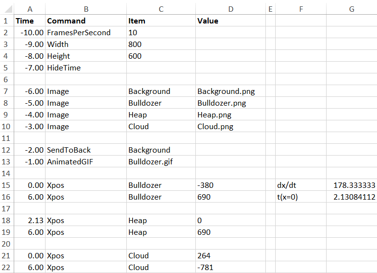
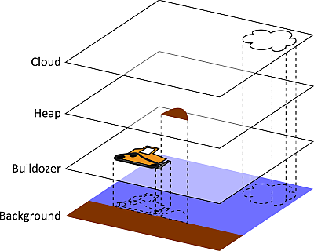
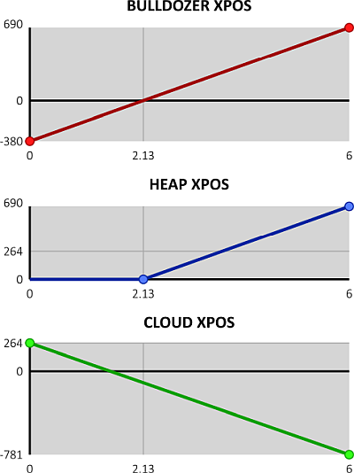

# Example 1. A bulldozer
A `SCRIPT` can look like this:

This script contains 4 images, all of them showing an item at their default position in the image without transformation:
1. Background.png
2. Bulldozer.png
3. Heap.png
4. Cloud.png

The images are stacked on top of each other like this:

The following sequence is played:
* The bulldozer will ride from `XPOS`=-380 (out of screen on the left side) to `XPOS`=+690 (out of screen on the right side)
* In cells G15 and G16, the time at which the bulldozer reaches `XPOS`=0 is calculated (t=2.13 s). This is the location at which the bulldozer reaches the heap.
* Cell A18 refers to the calculated time in G16. Between t=2.13 and t=6.00, the heap will slide from `XPOS`=0 (default position in the middle of the screen) to `XPOS`=+690 (out of screen on the right side)
* The cloud will move from `XPOS`=+264 at t=0 s to `XPOS`=-781 at t=6 s
* All other properties, such as `YPOS`, are not set, since their default values are OK

The final animation looks like this:

Remark:
* The bulldozer, heap and cloud images are now 800x600 pixels, just like the background. It would also have been possible to use smaller images for the bulldozer, heap and cloud, without the surrounding empty space. We should then modify `XPOS` and `YPOS` to compensate for the cropping on left and top. This would improve processing speed and memory use. The administrative burden of accounting for the cropped areas can be taken  care of by the spreadsheet. This was not done here to keep the example simple.
