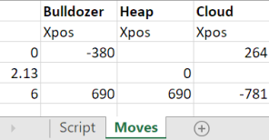

# Example 2: Bulldozer with table

The stack of this bulldozer is the same as in Example 1.

En this example, the same bulldozer animation is created, but this time a `TABLE` is used.

The movements of all items are now defined in a `TABLE` 'Moves' that is called by the main `SCRIPT`:

