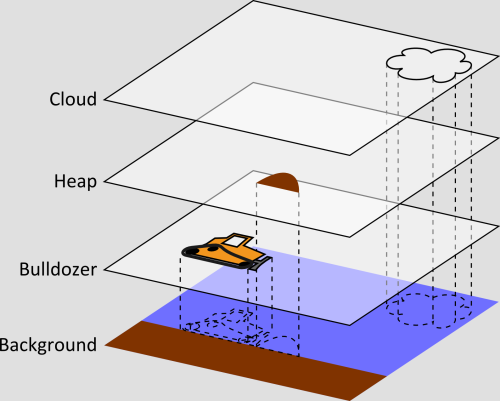
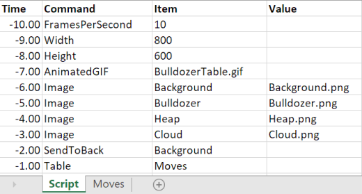

# Example 2: Bulldozer with table

The stack of this bulldozer is the same as in Example 1.

En this example, the same bulldozer animation is created, but this time a `TABLE` is used.

The movements of all items are now defined in a `TABLE` that is called by the main `SCRIPT`:

Remarks:
* The `TABLE` allows a more compact way to describe transitions
* The times in column A do not have to be ordered
* If numbers are missing for certain points in time, Animate will interpolate between the values that are present
* If `FIRSTFRAME` and `LASTFRAME` are not specified, the animation will run from t=0 until the last point in time specified
* Between time 0 and the first specified value, the property will be constant until the first specified value
* Same for the last specified value until the end of the animation

