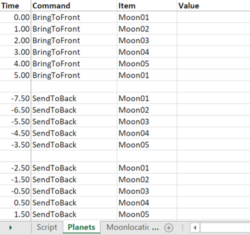

# Example 3: Solar system

In this example, 5 moons are spinning around a planet. Each moon is sent to the back when it is at the right of the planet, and brought to the front if it is left of the planet.

This is the result:

