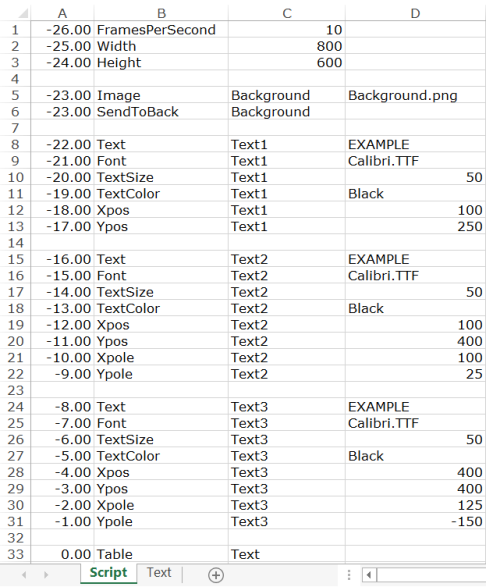
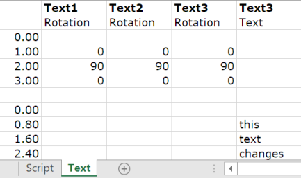

# Example 4. Rotating text

In the main `SCRIPT`, three text objects are defined, each with their own location and pole. The location of `XPOLE` and `YPOLE` is defined relative to the top left corner of the item:

The rotations are defined in a separate `TABLE`:

The result looks like this:

Here, it can clearly be seen that the location of `XPOLE` and `YPOLE` is defined relative to the top left corner of the item.

