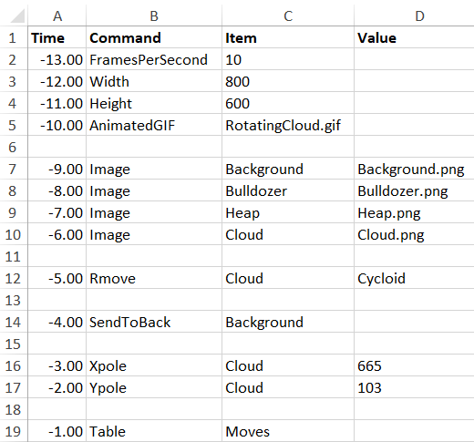
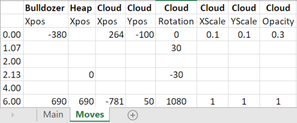

# Example 5: Rotating cloud

The main `SCRIPT` of the bulldozer example is again modified, now adding the `XPOLE` and `YPOLE` of the cloud. 

Also, a `TABLE` is added which defines  the rotation, scaling and opacity of the cloud.

The Moves `TABLE` is extended with cloud control:

Note that rotation can span more than 360°.

The resulting animation looks like this:

