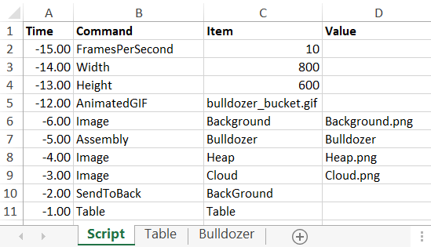
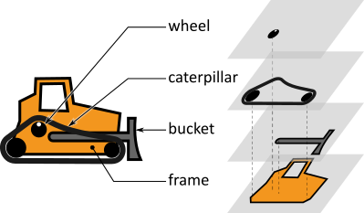
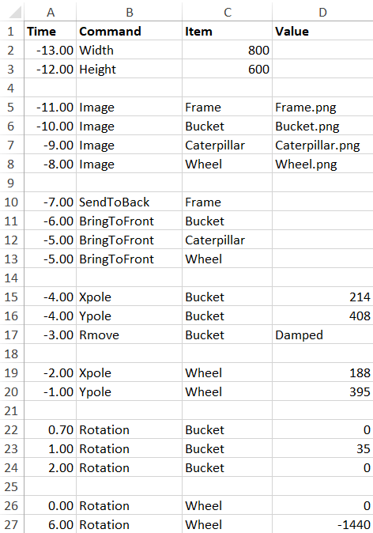

# Example 6: Bulldozer with bucket

In the main script, the global movement of the bulldozer is taken care of. In fact, the main script had only a minor change compared to example 1: instead of declaring the bulldozer as an `IMAGE`, it was now declared as an `ASSEMBLY`.

In the definition of the `ASSEMBLY` of the bulldozer, the bulldozer itself is drawn with the rotating wheel and bucket on it. 

The `ASSEMBLY` is made up of the following items:

The items are tied together as follows:

The result looks like this:

