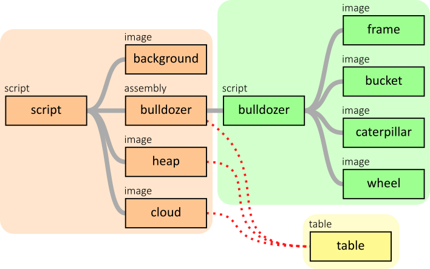

# Example 6: Bulldozer with bucket

In the main script, the global movement of the bulldozer, cloud and heap are still controlled by a `TABLE`. 

However, the bulldozer itself is now no longer an `IMAGE`, it has been replaced by an `ASSEMBLY` 'bulldozer'.

The hierarchy of the animation is defined as follows:

In the definition of the `ASSEMBLY` of the bulldozer, the bulldozer itself is drawn with the rotating wheel and bucket on it. 

The `ASSEMBLY` is made up of the following items:

Because the movements of the bucket and the wheel are quite simple, they are controlled within the 'Bulldozer' `SCRIPT`:

