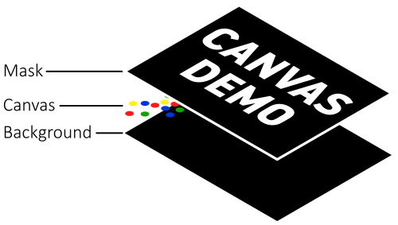
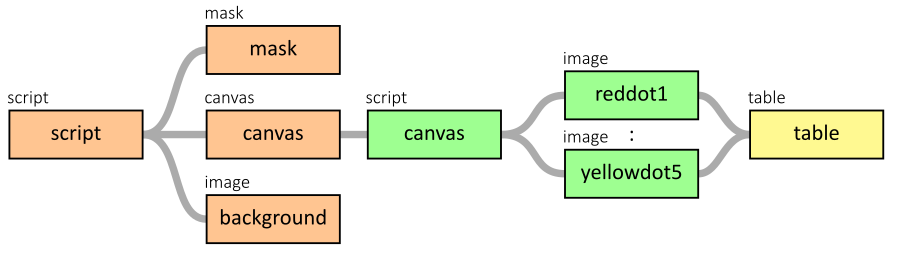

# Example 9: Canvas

The following stack is used for this example:

The canvas constains 20 dots; 5 of each color.

The hierarchy looks like this:

In the `TABLE`, `XPOS`, `YPOS`, `XSCALE` and `YSCALE` of each dot are controlled. These are all just random values.

This results in the following animation:

