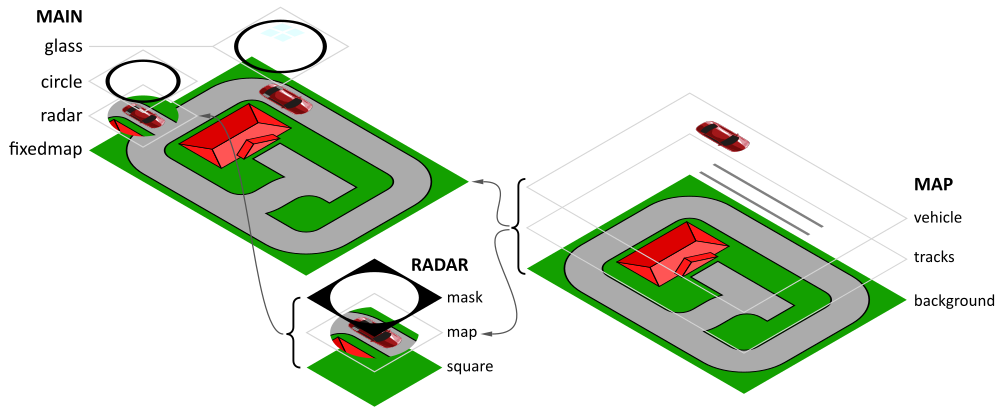
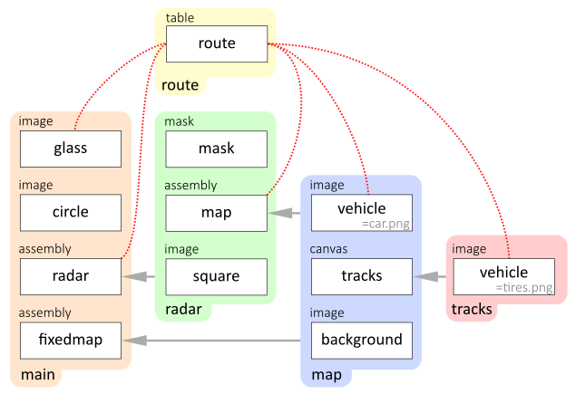
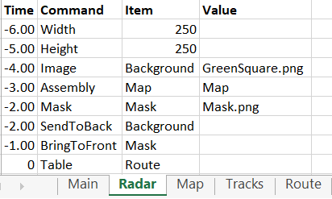

# Example 11: Camera

This example contains a map with a car driving on it. The tracks of the car remain visible as the car passes. The map with the driving car also appears in a circular inset in the lower left corner.

The stack is composed as follows:

The hierarchy is as follows:

The 'map' `ASSEMBLY` is used twice:
1. As a background, showing the car driving to the house, leaving behind the tracks
2. As an inset on the lower left corner 

The `TABLE` 'route' controls the movements in all assemblies:
1. The 'map' `ASSEMBLY` in the 'radar' `ASSEMBLY` is moving to keep the car in the middle of the circular 'mask'
2. The 'radar' `ASSEMBLY` in the 'main' `SCRIPT` is rotated to keep the car oriented to the right
3. The 'glass' `IMAGE` in the 'main' `SCRIPT` moves with the car. The coordinates are basically the same as the location of the 'map' `ASSEMBLY` in the 'radar' `ASSEMBLY`, except for the sign
4. The location and orientation of an item called `vehicle`. This controls two items: 
   * the `IMAGE` 'vehicle' in the `ASSEMBLY` 'map' displays an image of a car ('car.png')
   * the `IMAGE` 'vehicle' in the `ASSEMBLY` 'tracks' displays an image of the rear tires of the car ('tires.png') on the `CANVAS` 'map'

Remarks:
* The background `ASSEMBLY` in the 'main' `SCRIPT` is given the name 'FixedMap' instead of 'Map' to prevent the `TABLE` 'table' from modifying it's location, since the `TABLE` 'table' is also controlling the `ASSEMBLY` 'map' in the radar `ASSEMBLY`.
* The `IMAGE` 'vehicle' which displays the tires in the 'tracks' `CANVAS` is put in a separate `ASSEMBLY` 'tracks', since the 'map' `ASSEMBLY` can only contain one `ITEM` named 'vehicle'

The 'radar' `ASSEMBLY` moves the 'Map' `ASSEMBLY` under the mask:

The 'map' `ASSEMBLY` only has the 'background' `IMAGE` containing the map, the 'tracks' `CANVAS` and the car:

The tracks:

The location, orientation and pole of the car and the tires in the  `TABLE` are determined as follows.

If the image of the car is not rotated, the origin is in the top left corner (green dot):

The pole of rotation of the car is in line with the rear axis of the car
* If the car turns right, it turns around the red pole, which is located at (32,150)
* If the car turns left, it turns around the blue pole, which is located at (32,-75)

As the car rotates around the red pole, the origin remains at the original location:

The motion of the car is calculated as follows:

 

The movements of the car are planned like this:

| Trajectory | Movement |
|------------|----------|
| A to B | `XPOS` changes from 120 to 580 while `YPOS` remains constant at 36 |
| B to C | The car turns around the red pole. `ROTATION` changes from  0° to -90°   The location remains the same. |
| C to D | `YPOS` changes from 36 to 263 |
| D to E | The `ROTATION` changes from -90° to -180° |
| E to F | The `XPOS` changes from 580 to 343 |
| F to G | The `ROTATION` changes from -180° to -90° ||
| at G   | We must change from the red pole (32,150) to the blue pole (32,-75).   Since the car is rotated 180°, we must modify the `XPOS` and `YPOS` too to keep the car in the same location   Therefore, at the same time the location changes from (343,263) to (568,488) |
| G to H | The `YPOS` changes from 488 to 463 |
| H to I | The `ROTATION` changes from -90° to -180° |
| I to J | The `XPOS` changes from 568 to 434 to move the car to the front porch of the house |

The 'route' `TABLE` controls all movements and rotations:

Remarks:
* Note that at point G, when the pole of rotation and the location of the car change at the same time, the time is increased with just 0.01 sec. The very small time change is included to ensure the order of the events remains the same. If both events would have been planned at 4.36 s, the order of events would have been undefined.
* The x and y columns represent the middle of the car. Since they don't have an `ITEM` name in row 1, these are regarded as comments
* The location of the 'glass' is an offset of (-125,-125) to the middle of the 'glass'
* To keep the car in the middle of the radar, the location of the 'map' in the 'radar' has exactly the negative coordinates as the 'glass'
* To keep the car horizontal under the radar, the radar is rotated exactly opposite to the rotation of the car on the map
* Time is increased depending on the movements:
  * The car travels at 3 ms per pixel
  * Speed of rotation is calculated given the radius of rotation