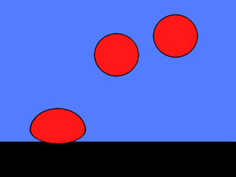

# Overview of examples
The examples explain the most important commands and can be used as inspiration. To use an example, copy the Excel file, the pictures directory and the python script to a new directory and run the python script.

[01-bulldozer](01-bulldozer/Readme.md) demonstrates `SCRIPT`, `IMAGE` and `XPOS`:

  

[02-bulldozer-with-table](02-bulldozer-with-table/Readme.md) produces the same result, now using the `TABLE` command.

[03-solar-system](03-solar-system/Readme.md) demonstrates `BRINGTOFRONT` and `SENDTOBACK`:

  

[04-rotating-text](04-rotating-text/Readme.md) demonstrates `TEXT`, `XPOLE` and `YPOLE`:

  

[05-rotating-cloud](05-rotating-cloud/Readme.md) demonstrates `XPOLE`, `YPOLE`, `ROTATION` and `OPACITY`:

  

[06-bulldozer-with-bucket](06-bulldozer-with-bucket/Readme.md) uses an `ASSEMBLY` to move the bucket and the wheel of the bulldozer. `YMOVE` is used to create the bouncing cloud:

  

[07-bouncing-balls](07-bouncing-balls/Readme.md) demonstrates `ASSEMBLY` and `TIMEOFFSET`. All three balls are created by a single assembly. The ball is split in two to mimic the compression as it bounces on the floor. The lower half of the ball uses `XSCALE` and `YSCALE`, the upper half only `XSCALE`.

  

[08-two-cylinders](08-two-cylinders/Readme.md) demonstrates the `MASK` item and some complex arithmetic in the spreadsheet to model the bubbles speeding up in the tube:

  

[09-canvas](09-canvas/Readme.md) demonstrates the `CANVAS`:

  

[10-car](10-car/Readme.md) also uses a `CANVAS` to draw the tire tracks, and demonstrates a `TABLE` driving multiple `SCRIPT`s:

  

[11-camera](11-camera/Readme.md) demonstrates the use of an `ASSEMBLY` on multiple levels, one viewed through a `MASK` and `ROTATE`d:

  

[12-sewing-machine](12-sewing-machine/Readme.md) is a similar example of a sewing machine

  
