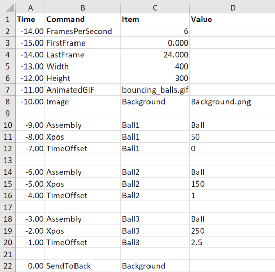
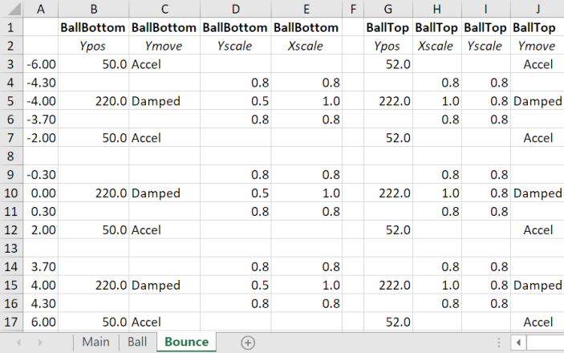
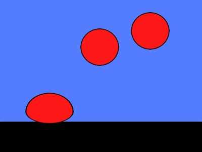

# Example 7: Bouncing balls

In this example, three balls are displayed which bounce on the ground. As each ball bounces, the bottom of the ball is compressed and the ball becomes wider.

In the main script, three balls are declared, each with their own `XPOS` and `TIMEOFFSET`. All other moving and scaling of each ball is handled by the 'Ball' `SCRIPT` and the 'Bounce' `TABLE`:

The ball assembly consists of two half circles, one flipped upside down:

The bouncing and scaling of the ball is defined in a table:

This produces the following animation:

