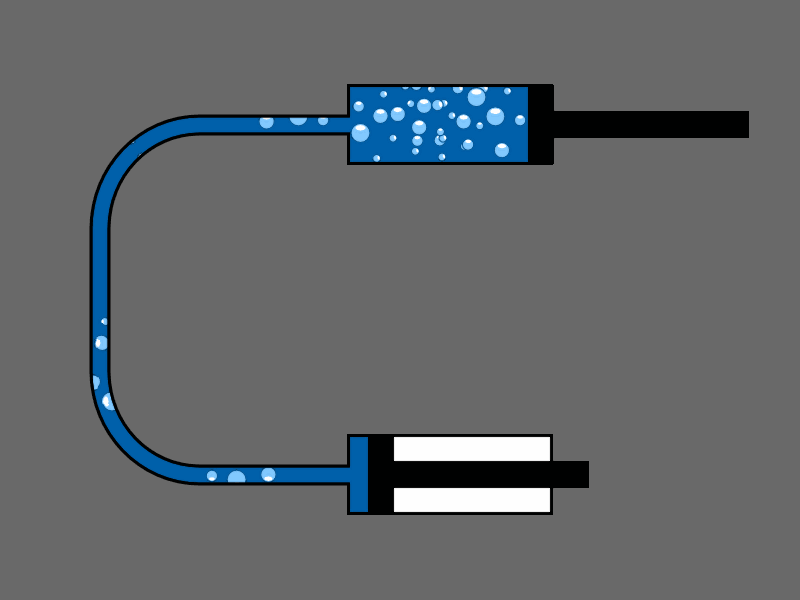
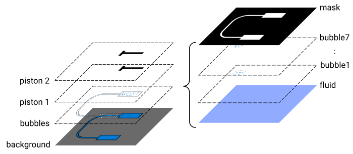
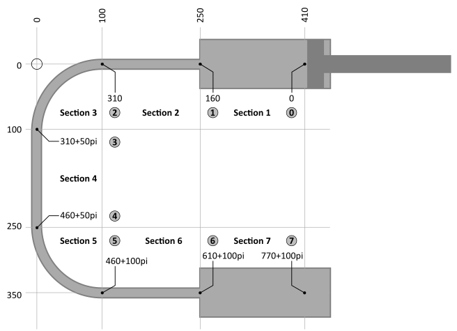
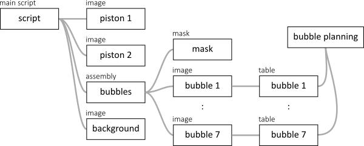

# Example 8: Two cylinders

In the following example, two hydraulic cylinders are connected by a tube. In the tube, the fluid moves faster than in the cylinders. Also, the bubbles need to follow the trajectory of the tube as they are going from one cylinder to the other. 

The stack of this animation is built up as follows:

The fluid system is divided in 7 sections
1. cylinder 1
1. straight tube section
1. bended tube section
1. straight tube section
1. bended tube section
1. straight tube section
1. cylinder 2

In the `SCRIPT` bubbles, 7 bubble items are declared, each with an image with random bubbles, selected from 3 images. An additional sheet 'bubble planning' is used to plan out the location, orientation and speed of each group of bubbles. The main `SCRIPT` script shows a background image, the `ASSEMBLY` with the bubbles, and two pistons.

The bubbles `ASSEMBLY` shows 7 `IMAGE`s of bubbles, each driven by their own `TABLE` which controls location and orientation. On top of the 7 `IMAGE`s, a `MASK` covers the bubbles that are outside the tube. The location and orientation of the bubbles in each of the `TABLE`s is in turn controlled by the sheet 'bubble planning', which just takes care of the mathematics for each section.

