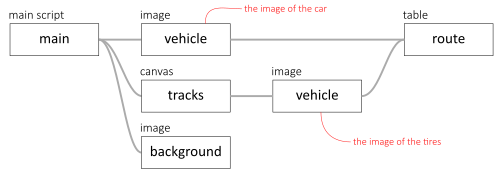
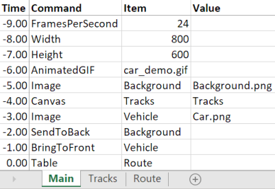
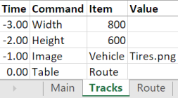
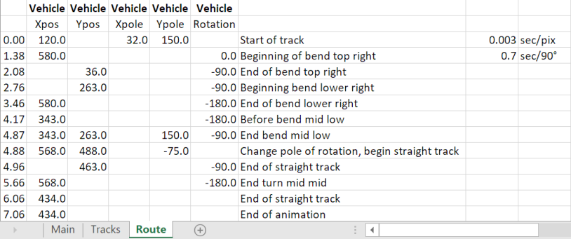

# Example 10: Car

This example uses three images: 
1. background
1. tires of the car
1. car itself

The car needs to follow a certain route on the road. The imprint of the tires is recorded on a canvas. The hierarchy is built up as follows:

In this case, the car and the tires have the same image dimensions and are both named 'Vehicle'. Also, the `SCRIPT` 'Main' and the `CANVAS` 'Tracks' both call the `TABLE` 'Route'. In this table, location and orientation of the 'Vehicle' item is controlled. Since both the tires and the car are called 'Vehicle' in their respective worksheers, the `TABLE` modifies location and orientation of both items in exactly the same way.

The main `SCRIPT`:

The `CANVAS` named Tracks:

The `TABLE` named Route:

The time intervals are calculated based on a fixed speed in linear movements, and a fixed amount of time for each curve.
