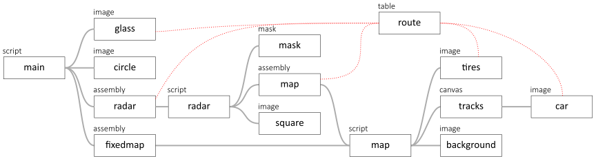
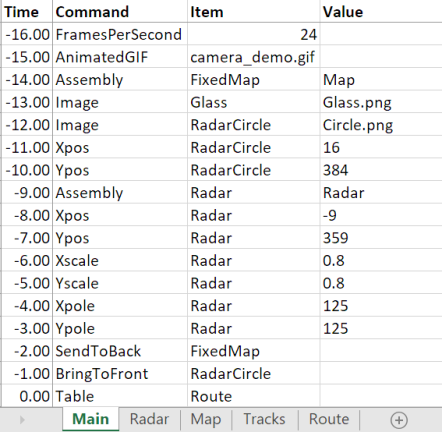
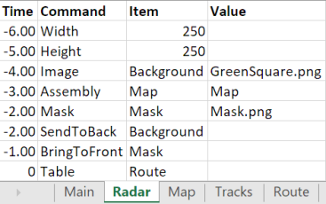
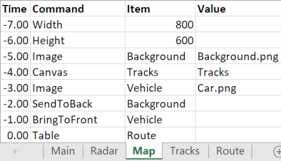
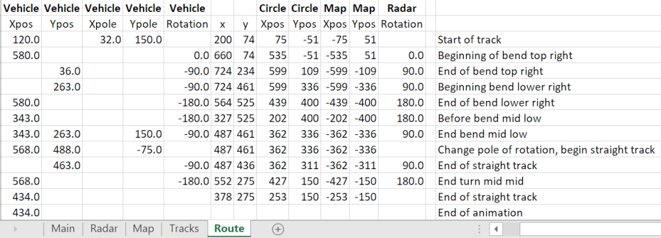

# Example 11: Camera

In this example, the car from the previous example is now embedded in an `ASSEMBLY`, which is used twice, higher up in the hierarchy.

In this example, a higher level of hierarchy is added on top of the main `SCRIPT`. The main `SCRIPT` in the previous example is now an `ASSEMBLY` 'Map' which is used twice: once in the `SCRIPT` 'Main', and once in an `ASSEMBLY` named 'Radar'. 

The 'Radar' `ASSEMBLY` is just 250x250 pixels, and it has circular mask. Below the circular `MASK`, the 'Map' `ASSEMBLY` is moving in X and Y direction, such that car is below the center of the circular mask.

In the 'Main' `SCRIPT`, the 'Map' `ASSEMBLY` is displayed just like in the previous example. On op of the 'map', several items are displayed:
* a magnifying glass, which moves with the car
* the 'Radar' `ASSEMBLY` which is scaled down and rotates with the orientation of the car
* a circle on top of the radar image

The hierarchy is now more complex:

In the 'main' `SCRIPT`, the following items are created:
1. Glass: the magnifying glass which hovers over the car
1. Circle: a black circle around the radar screen
1. Radar: the small radar screen in the bottom left corner
1. FixedMap: the `ASSEMBLY` 'map' with the map and the driving car. It is now renamed 'FixedMap' to prevent the `TABLE` 'table' from modifying it's position

The 'Radar' `ASSEMBLY` basically moves the 'Map' `ASSEMBLY` under the mask.

The 'Map' `ASSEMBLY` only has the background map, the tyres `CANVAS` and the Car:

The 'Route' `TABLE` controls all movements and rotations:

